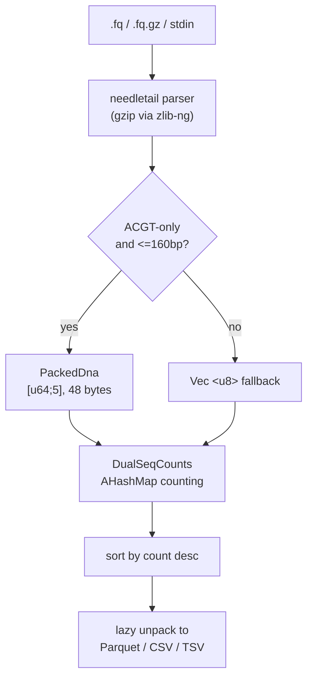

# seqtable

High-performance FASTQ sequence counter.

Counts unique sequences in FASTQ files and outputs sorted results in Parquet, CSV, or TSV format.

[](https://opensource.org/licenses/MIT)

## Installation

```bash
# Run directly (no install)
nix run github:mulatta/seqtable -- input.fq.gz -o results/

# Temporary shell with seqtable available
nix shell github:mulatta/seqtable
seqtable input.fq.gz

# Persistent install
nix profile install github:mulatta/seqtable

# From source
git clone https://github.com/mulatta/seqtable
cd seqtable
cargo build --release
```

## Usage

```
seqtable [OPTIONS] <INPUT>...

Arguments:
  <INPUT>...  Input FASTQ file path(s), or "-" for stdin

Options:
  -o, --output-dir <DIR>          Output directory [default: .]
  -f, --format <FORMAT>           Output format [default: parquet]
                                  [possible values: parquet, csv, tsv]
  -t, --threads <THREADS>         Number of threads (0 = auto) [default: 0]
  -q, --quiet                     Suppress all status output
      --compression <COMPRESSION> Parquet compression [default: zstd]
                                  [possible values: none, snappy, gzip, brotli, zstd]
      --rpm                       Include RPM (Reads Per Million) column
  -h, --help                      Print help
  -V, --version                   Print version
```

### Basic

```bash
seqtable input.fq.gz
seqtable input.fq.gz -o results/ -f csv --rpm
seqtable input.fq.gz -f tsv -t 4
```

### Multiple files

Files are processed in parallel automatically:

```bash
seqtable sample1.fq.gz sample2.fq.gz sample3.fq.gz -o results/
```

### Stdin

Accept `-` to read from stdin. Useful for piping from other tools without intermediate files:

```bash
# Pipe from fastp (no intermediate file)
fastp -i raw.fq.gz -o /dev/stdout | seqtable - -o results/ -f csv

# Decompress with external tools
zcat input.fq.gz | seqtable - -o results/

# Sample first 1M reads
head -n 4000000 input.fq | seqtable - -o results/
```

## Output

Results are sorted by count (descending). Output filename is derived from input (e.g., `input.csv`, `stdin.parquet`).

```csv
sequence,count,rpm
ACGTACGTACGTACGT,150000,75000.00
GCTAGCTAGCTAGCTA,100000,50000.00
TTAATTAATTAATTAA,50000,25000.00
```

### Reading Parquet

```python
import polars as pl
df = pl.read_parquet("input.parquet")
```

```sql
-- DuckDB
SELECT * FROM 'input.parquet' LIMIT 10;
```

## Performance

Benchmarked with hyperfine (warmup=3, runs=5) against `awk 'NR%4==2{a[$0]++}END{...}' | sort -rn`:

| Data | Reads | seqtable | awk + sort | Speedup |
|------|-------|----------|------------|---------|
| 22bp, plain FASTQ | 1M | 0.17s | 1.04s | 6.2x |
| 22bp, gzip | 20M | 4.7s | 25.0s | 5.3x |
| 100-300bp, gzip | 20M | 18.8s | 37.2s | 2.0x |
| 151bp, gzip (real) | 13.6M | 12.9s | 55.8s | 4.3x |

### Memory

Memory usage is proportional to the number of unique sequences, not file size:

```
RSS = ~35 MB (base) + unique_count * bytes_per_unique

bytes_per_unique:
  ACGT-only, <=160bp:  ~140 bytes  (2-bit packed)
  other (N, >160bp):   ~150 + seq_len bytes
```

| Scenario | Unique sequences | RSS |
|----------|-----------------|-----|
| Illumina 151bp, 13M unique | 13M | 1.9 GB |
| Amplicon 200bp, 1M unique | 1M | 0.3 GB |
| Short 22bp, 181K unique | 181K | 43 MB |

## How it works



Key optimizations:

- **2-bit DNA encoding**: ACGT bases packed 2 bits each into `[u64;5]`. Covers up to 160bp with 48-byte fixed-size keys (vs ~190 bytes for `Vec<u8>`). Eliminates heap allocation for 99.9% of Illumina reads.
- **Lazy unpack**: Packed sequences stay as `PackedDna` through sorting and are only decoded to ASCII during output, avoiding a full `Vec<u8>` copy per unique sequence.
- **get_mut probe pattern**: Check existing key first, insert only on miss. Faster than `entry()` API for this workload (benchmarked).
- **zlib-ng backend**: flate2 compiled with zlib-ng for faster gzip decompression.

## Supported formats

| Format | Extensions | Compression |
|--------|-----------|-------------|
| FASTQ | `.fastq`, `.fq` | - |
| FASTQ gzip | `.fastq.gz`, `.fq.gz` | gzip |
| stdin | `-` | auto-detected |

FASTA files are not supported.

## Development

```bash
nix develop
cargo test
cargo bench
```

### Generate test fixtures

```bash
cargo run --example generate_fixtures --release -- --size small
```

### Benchmark

```bash
nix run .#benchmark -- small
```

## License

MIT

## Acknowledgments

- [needletail](https://github.com/onecodex/needletail) - FASTQ parsing
- [ahash](https://github.com/tkaitchuck/aHash) - Fast hashing
- [arrow-rs](https://github.com/apache/arrow-rs) - Parquet support
